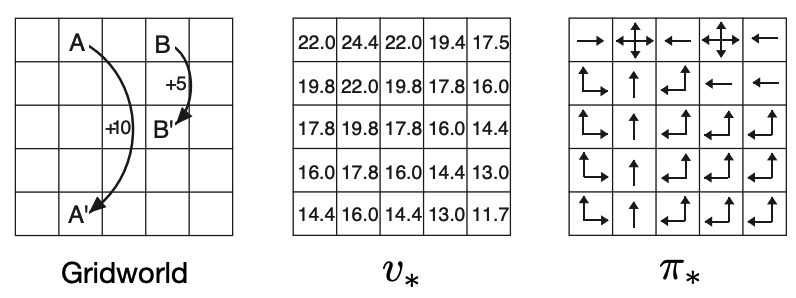

# Assignment 1: Hello GridWorld

In this assignment, you are required to solve the Bellman equation for the simple grid task introduced in Example 3.5 in
[this RL book](http://incompleteideas.net/book/RLbook2020.pdf).

### GridWorld
The cells of the grid correspond to the states of the environment. 
At each cell, four actions are possible: north, south, east, and west, which deterministically cause the agent to move 
one cell in the respective direction on the grid. 
Actions that would take the agent off the grid leave its location unchanged, but also result in a reward of -1. 
Other actions result in a reward of 0, except those that move the agent out of the special states A and B. 
From state A, all four actions yield a reward of +10 and take the agent to A'. 
From state B, all actions yield a reward of +5 and take the agent to B'.
The discount factor is given as 0.9.

### Requirement
You are required to complete ```try.py``` for solving the Bellman equation. 
If the equation is correctly solved, you will get the same v* shown below.
If you find it difficult, you can refer to ```value.py``` for inspiration.

### BONUS
(a) Derive the optimal policy according to v*  
(b) Accelerate (hint: try to avoid loop)

